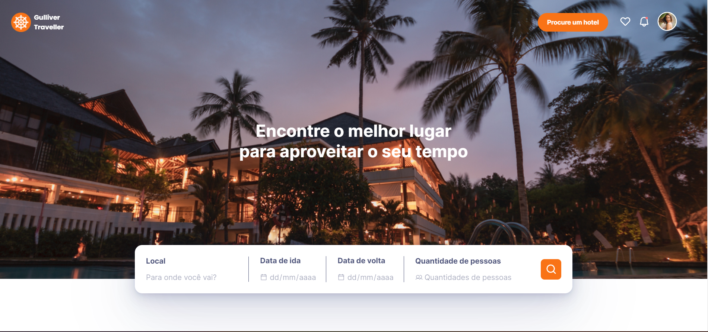
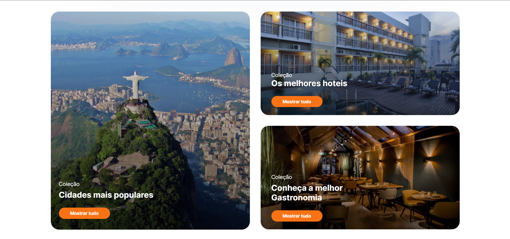
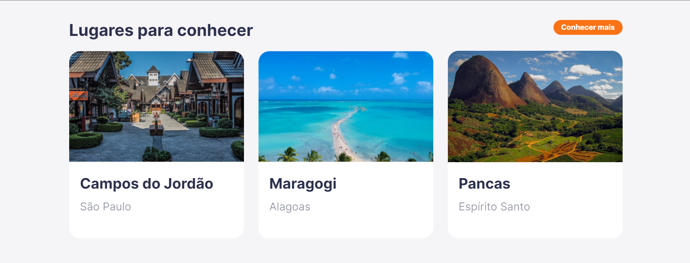
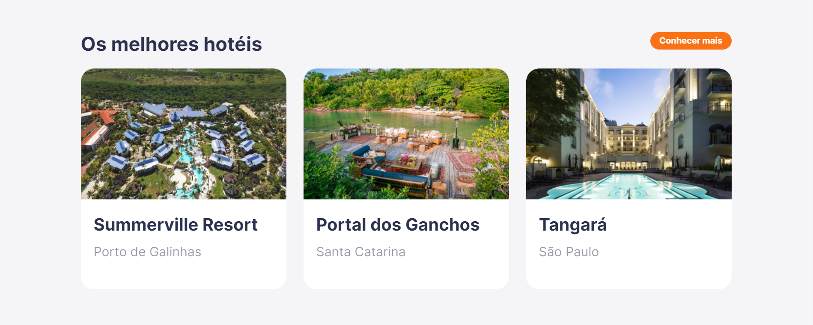
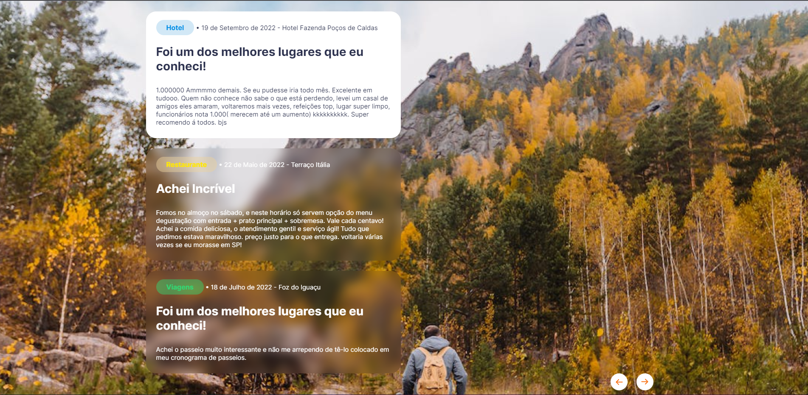
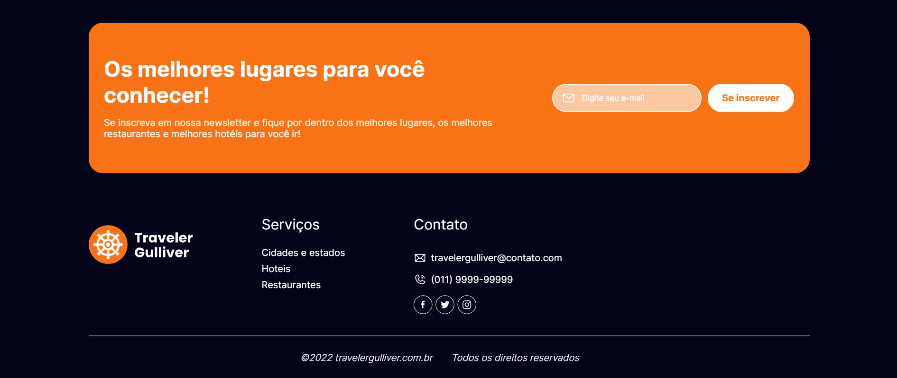

<h1 align="center" style="display: flex; align-items: center; justify-content: center; gap: 8px;">
  

  Gulliver Traveller
</h1>

  

## Projeto do challenge Gulliver da Fiap

 

Utilizamos a ferramenta firebase | FireStore para importar o login e senha do usuário. Login do usuário desenvolvido em popUp onde, ao clicar no perfil, a janela de login abrirá.

 

# Rotas
- Home: /index.html
- Logins cadastrados: /logins.html
- O Gulliver Traveller conta com uma interface dinâmica para o usuário, no qual todas as informações são encontradas na home.

Banco de dados: FireStore
Front-end: Html, CSS, Js
Back-end: API
Hospedagem na nuvem: Vercel
Integração: API Google Maps
Usabilidade: ok
Acessibilidade: Vlibras

//Acréscimo da política de Privacidade

## Tecnologias

- HTML
- CSS
- JS
- GIT
- GITHUB
- FIREBASE | FIRESTORE

 
 

## 🔖 Layout

  

  

  

  

  

  

  

